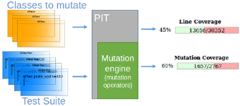
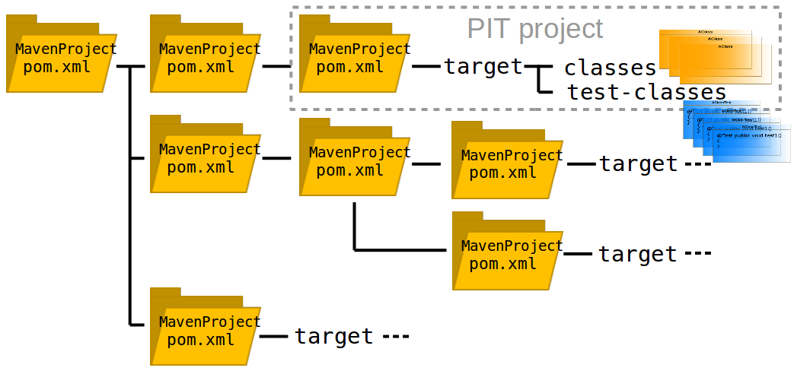
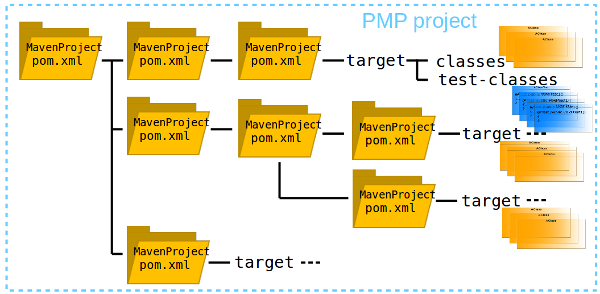
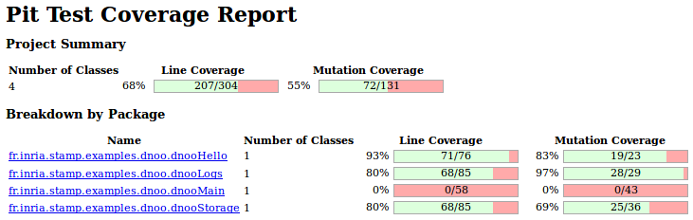
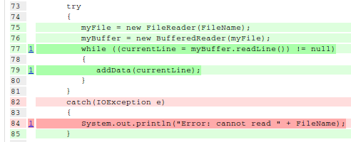

What is PMP?
===========
PMP stands for PIT Multi-module Project Maven plugin

It's a Maven plugin able to run PIT on multi-module projects.
PIT is a mutation testing system for Java applications, which allows you to evaluate
the quality of your test suites.

To know more about PIT: http://pitest.org


How does PMP work?
==================

PIT takes a test suite, a set of classes to be mutated and a set of mutation operators
and computes a line coverage and a mutation coverage:


But PIT mutates only the classes defined in the same module (MavenProject) than the
test suite:


PMP runs a test suite, mutating classes of all dependencies of modules located in
the same project tree:


PMP just extends PIT, it doesn't redefine PIT features.
PMP runs test suite as PIT does, just extending the list of classes to be
mutated to the whole project tree, instead of mutating only the classes of
the test suite module.


Output of PMP
=============

PIT produces a report that includes:
* a summary of line coverage and mutation coverage scores:

* a detail report for each class combining line coverage and mutation coverage
information:

Light green shows line coverage, dark green shows mutation coverage.
Light pink show lack of line coverage, dark pink shows lack of mutation coverage.


Run PMP on your project
===========================

Install the plugin
------------------
```
git clone https://github.com/STAMP-project/pitmp-maven-plugin.git
cd pitmp-maven-plugin
mvn install
```

Run PMP
-------
* Go to the project on which you want to apply PIT

* Add to your root project pom.xml, in the \<plugins\> section:
```
  <plugin>
    <groupId>fr.inria.stamp.plugins</groupId>
    <artifactId>pitmp-maven-plugin</artifactId>
    <version>version.you.want</version>
    <!-- list all the packages of the project that contain classes you want to be mutated    -->
    <configuration>
      <targetClasses>
        <param>a.package.of.classes*</param>
        <param>another.package.of.classes*</param>
      </targetClasses>
    </configuration>
    <dependencies>
      <dependency>
        <groupId>org.pitest</groupId>
        <artifactId>pitest-maven</artifactId>
        <version>pitest.version</version>
      </dependency>
    </dependencies>
  </plugin>
```
* Compile your project
```
mvn install
```
* Run PIT on your multimodule project :-)
```
mvn pitmp:run
```

PMP properties
--------------
* targetModules: to run PIT only on specified modules
You can use the property "targetModules" in the pom.xml:
```
          <targetModules>
            <param>yourFirstModule</param>
            <param>anotherModule</param>
          </targetModules>
```
or on the command line, use:
```
mvn "-DtargetModules=yourFirstModule,anotherModule" pitmp:run
```
Running PMP from a module directory will NOT work.
* skippedModules: to run PIT only on specified modules
You can use the property "skippedModules" in the pom.xml:
```
          <skippedModules>
            <param>aModuleToSkip</param>
            <param>anotherModuleToSkip</param>
          </skippedModules>
```
or on the command line, use:
```
mvn "-DtargetModules=aModuleToSkip,anotherModuleToSkip" pitmp:run
```

Running Descartes
-----------------
If you want to run Descartes, use the v1.0.1. Descartes supports only PiTest v1.2.0 for now.
If you want to run Descartes, add to your root project pom.xml, in the \<plugins\> section:
```
  <plugin>
    <groupId>fr.inria.stamp.plugins</groupId>
    <artifactId>pitmp-maven-plugin</artifactId>
    <version>version.you.want</version>
    <!-- list all the packages of the project that contain classes you want to be mutated    -->
    <configuration>
      <targetClasses>
        <param>a.package.of.classes*</param>
        <param>another.package.of.classes*</param>
      </targetClasses>
      <mutationEngine>descartes</mutationEngine>
      <mutators>
        <mutator>void</mutator>
        <mutator>null</mutator>
        <mutator>true</mutator>
        <mutator>false</mutator>
        <mutator>empty</mutator>
        <mutator>0</mutator>
        <mutator>1</mutator>
        <mutator>(byte)0</mutator>
        <mutator>(byte)1</mutator>
        <mutator>(short)1</mutator>
        <mutator>(short)2</mutator>
        <mutator>0L</mutator>
        <mutator>1L</mutator>
        <mutator>0.0</mutator>
        <mutator>1.0</mutator>
        <mutator>0.0f</mutator>
        <mutator>1.0f</mutator>
        <mutator>'\40'</mutator>
        <mutator>'A'</mutator>
        <mutator>""</mutator>
        <mutator>"A"</mutator>
      </mutators>
    </configuration>
    <dependencies>
      <dependency>
        <groupId>org.pitest</groupId>
        <artifactId>pitest-maven</artifactId>
        <version>1.2.0</version>
      </dependency>
      <dependency>
        <groupId>fr.inria.stamp</groupId>
        <artifactId>descartes</artifactId>
        <version>0.2-SNAPSHOT</version>
      </dependency>
    </dependencies>
  </plugin>
```

For complete instructions about Descartes see the [Descartes github](https://github.com/STAMP-project/pitest-descartes).

For an example of multi module project using PMP see the [dnoo github](https://github.com/STAMP-project/dnoo).

Releases
--------
* v1.0.1
  - tested with PIT v1.2.0 and Descartes v0.2-SNAPSHOT
  - tested with PIT v1.2.3
* v1.1.0
  - tested with PIT v1.3.1

Tested on
---------
* [dhell project on github](https://github.com/STAMP-project/dhell)
* [dnoo project on github](https://github.com/STAMP-project/dnoo)
* [xwiki-commons project on github](https://github.com/xwiki/xwiki-commons)
* [xwiki-rendering project on github](https://github.com/xwiki/xwiki-rendering)

Feedbacks are welcome ! :-)
